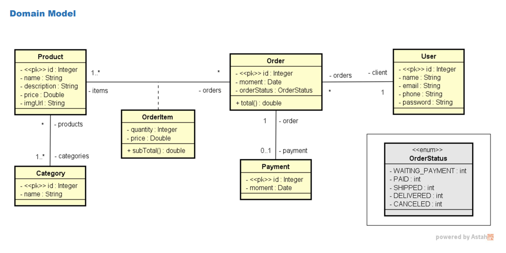

# Spring Boot e JPA/Hibernate - PostgreSQL | Web services 

## Descrição

O projeto em `Springboot e JPA` desenvolvido consiste em uma aplicação que implementa o modelo de domínio e estrutura em camadas lógicas de recursos, serviços e repositórios. O objetivo é simular o `back-end` de um e-commerce simples.
Dentre as característcas do projeto, os principais consistem em:

- Operações internas ao Banco de Dados: 
  - CRUD - Create, Retrieve, Update, Delete
- Configurar banco de dados de teste (H2)
- Criação de tratamento de exceções personalizadas
- Criação de endpoints para consumo da API e testes pelo software `Postman`
- Configurações para deploy em plataforma de nuvem - `Heroku`

## Tecnologias utilizadas
- Java
- Spring Boot
- JPA / Hibernate
- Maven
- H2
- Postman
- Heroku
### Banco de dados
- PostgreSQL

## Modelo conceitual


# Executando o projeto

```bash
# clonar repositório
git clone https://github.com/lucasnatanmelo/Spring-Boot-e-JPA-Hibernate-PostgreSQL.git

# acessar a pasta 
cd Springboot-PostgreSQL

# executar o projeto
./mvnw spring-boot:run
```

## API - endpoints

- ## Categories:
  - **GET:** `/categories`
    - Retorna uma lista com todas as categorias cadastradas no sistema.
  - **GET:** `/categories/{id}`
    - Retorna a categoria correspondente ao id informado.

- ## Orders:
  - **GET:** `/orders` 
    - Retorna uma lista com todas as ordens cadastradas no sistema.
  - **GET:** `/orders/{id}` 
    - Retorna a ordem correspondente ao id informado.

- ## Products:
  - **GET:** `/products` 
    - Retorna uma lista com todos os produtos cadastrados no sistema.
  - **GET:** `/products/{id}` 
    - Retorna o produto correspondente ao id informado.

- ## Users:
  - **GET:** `/users` 
    - Retorna uma lista com todos os usuários cadastrados no sistema.
  - **GET:** `/users/{id}` 
    - Retorna o usuário correspondente ao id informado.
  - **POST:** `/users` 
    - Cadastra um novo usuário no sistema.
  - **DELETE:** `/users/{id}` 
    - Exclui o usuário correspondente ao id informado.
  - **PUT:** `/users/{id}` 
    - Atualiza as informações do usuário correspondente ao id informado.